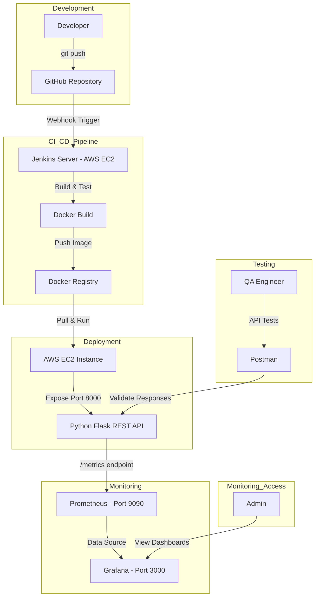
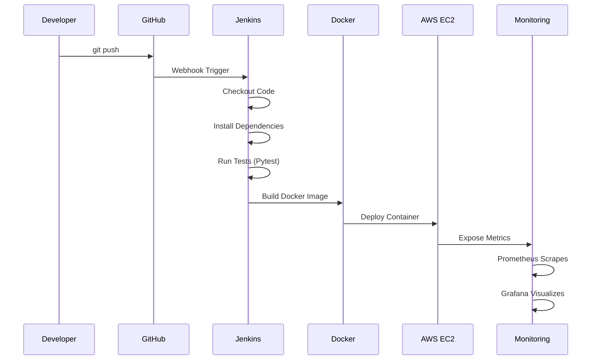

This project demonstrates a complete end-to-end DevOps workflow for building, deploying, monitoring, and validating a Python-based REST API application using modern DevOps tools and best practices. It simulates a real-world production DevOps setup, covering CI/CD automation, containerization, cloud deployment, monitoring, visualization, and API testing.

🔁 CI/CD Automation

🐳 Containerization

☁️ Cloud Deployment (AWS EC2)

📊 Monitoring & Metrics Collection

📈 Visualization Dashboards

🧪 API Testing

🛠️ Tools & Technologies
Category	Tools Used
🗂️ Source Control	GitHub
🔁 CI/CD	Jenkins
🐳 Containerization	Docker
☁️ Cloud Platform	AWS EC2 (Linux)
📈 Monitoring	Prometheus
📊 Visualization	Grafana
🧪 API Testing	Postman
🐍 Backend	Python (Flask)

🧩 System Architecture

🔄 CI/CD Pipeline Flow

    J->>D: Build Docker Image
    D->>AWS: Deploy Container
    AWS->>M: Expose Metrics
    M->>M: Prometheus Scrapes
    M->>M: Grafana Visualizes
